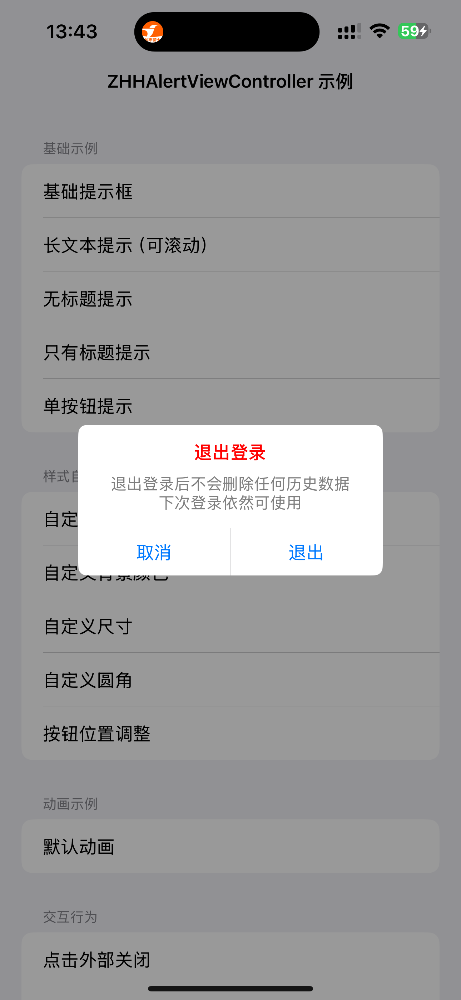
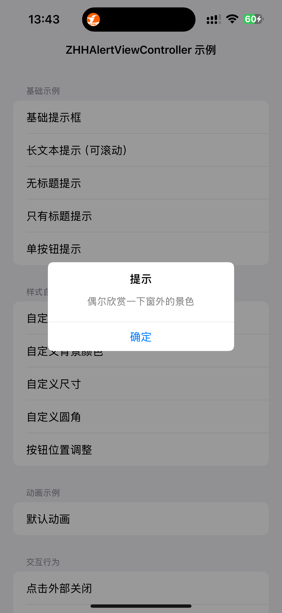
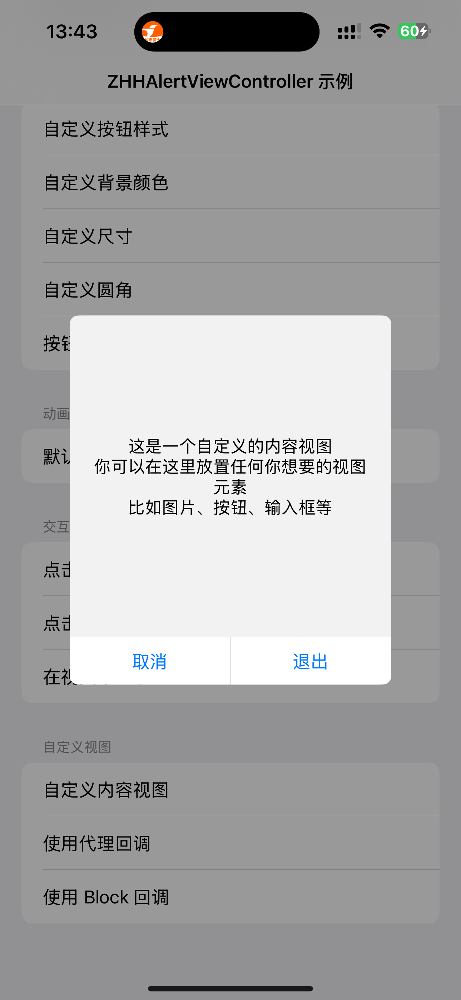
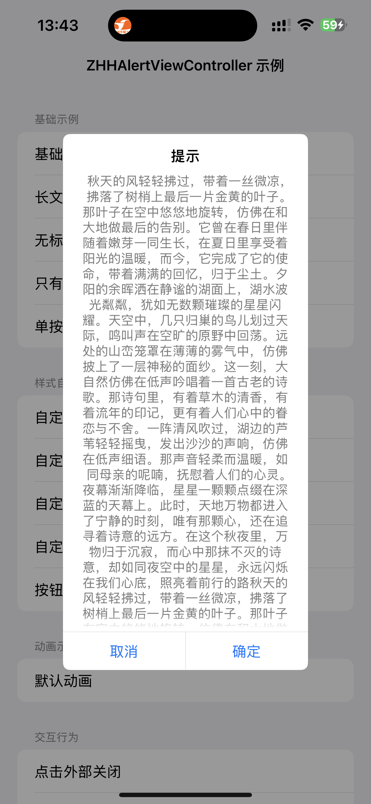

# ZHHAlertViewController

`ZHHAlertViewController` 是 UIKit 的 `UIAlertView` 的最佳替代方案。使用 `ZHHAlertViewController`，您可以用几行代码轻松创建所需的 AlertView 视图。

## 特性

- ✅ **高度可定制**：支持自定义样式、布局、动画等
- ✅ **平滑动画**：支持默认动画和无动画两种模式
- ✅ **灵活布局**：支持自定义间距、尺寸、圆角等
- ✅ **代理和 Block 回调**：支持代理模式和 Block 回调两种方式
- ✅ **模糊背景**：支持自定义背景模糊效果
- ✅ **滚动阴影**：长文本内容支持滚动阴影效果，提升用户体验
- ✅ **Auto Layout**：基于 Auto Layout 实现，适配各种屏幕尺寸
- ✅ **简单易用**：API 设计简洁，易于集成和使用

## 截图

<div align="center">
  
  
  
  
</div>

## 安装

### CocoaPods

在 `Podfile` 中添加：

```ruby
pod 'ZHHAlertViewController'
```

然后运行：

```bash
pod install
```

## 快速开始

### 基础用法

```objc
#import <ZHHAlertViewController/ZHHAlertViewController.h>

// 创建并显示一个简单的 Alert
ZHHAlertViewController *alert = [[ZHHAlertViewController alloc] init];
alert.title = @"提示";
alert.content = @"这是一个简单的提示框";
alert.cancelButtonTitle = @"取消";
alert.otherButtonTitle = @"确定";
[alert show];
```

### 使用 Block 回调

```objc
ZHHAlertViewController *alert = [[ZHHAlertViewController alloc] init];
alert.title = @"确认";
alert.content = @"确定要删除这条记录吗？";
alert.cancelButtonTitle = @"取消";
alert.otherButtonTitle = @"删除";

alert.cancelButtonAction = ^{
    NSLog(@"点击了取消按钮");
};

alert.otherButtonAction = ^{
    NSLog(@"点击了删除按钮");
    // 执行删除操作
};

[alert show];
```

### 使用 Delegate

```objc
@interface MyViewController () <ZHHAlertViewControllerDelegate>
@end

@implementation MyViewController

- (void)showAlert {
    ZHHAlertViewController *alert = [[ZHHAlertViewController alloc] init];
    alert.title = @"提示";
    alert.content = @"这是一条提示信息";
    alert.cancelButtonTitle = @"确定";
    alert.delegate = self;
    [alert show];
}

#pragma mark - ZHHAlertViewControllerDelegate

- (void)alertViewDidClickCancelButton:(ZHHAlertViewController *)alertView {
    NSLog(@"点击了取消按钮");
}

- (void)alertViewDidClickOtherButton:(ZHHAlertViewController *)alertView {
    NSLog(@"点击了其他按钮");
}

@end
```

## API 文档

### 动画类型

`ZHHAlertViewAnimationType` 枚举定义了以下动画类型：

```objc
typedef NS_ENUM(NSInteger, ZHHAlertViewAnimationType) {
    ZHHAlertViewAnimationTypeNone        = 0,  // 无动画
    ZHHAlertViewAnimationTypeDefault     = 1   // 默认动画
};
```

### 主要属性

#### 视图相关属性

- `customContentView`：自定义 Alert 的内容视图
- `cancelButton`：取消按钮（可自定义样式）
- `otherButton`：其他按钮（可自定义样式）
- `titleLabel`：标题标签（可自定义样式）
- `contentLabel`：内容标签（可自定义样式）

#### 布局相关属性

- `titleTopPadding`：标题距父视图顶部的间距（默认 14pt）
- `titleBottomPadding`：标题与正文内容之间的垂直间距（默认 2pt）
- `contentLeftRightPadding`：标题和正文共用的左右内边距（默认 20pt）
- `buttonTopPadding`：按钮区域距正文底部的间距（默认 20pt）
- `buttonBottomPadding`：按钮距父视图底部的间距（默认 0pt）
- `buttonLeftRightPadding`：按钮区域左右内边距（默认 0pt）
- `buttonSpacing`：多个按钮之间的水平间距（默认 0pt）
- `buttonHeight`：按钮高度（默认 44pt）
- `width`：弹窗整体宽度（默认 284pt）
- `height`：弹窗整体高度（默认 135pt）
- `cornerRadius`：弹窗圆角半径（默认 8pt）

#### 文字内容相关属性

- `title`：标题文本
- `content`：正文内容文本
- `cancelButtonTitle`：取消按钮文字
- `otherButtonTitle`：其他按钮文字

#### 样式配置

- `separatorColor`：分隔线颜色，默认与系统一致

#### 动画配置

- `appearAnimationType`：弹出动画类型（默认 `ZHHAlertViewAnimationTypeDefault`）
- `disappearAnimationType`：消失动画类型（默认 `ZHHAlertViewAnimationTypeDefault`）
- `appearTime`：弹出动画时长（默认 0.2 秒）
- `disappearTime`：消失动画时长（默认 0.1 秒）

#### 行为配置

- `cancelButtonPositionRight`：是否将取消按钮显示在右侧（默认 NO）
- `shouldHighlightButtonOnClick`：按钮点击是否高亮（默认 YES）
- `shouldDismissOnActionButtonClicked`：点击按钮是否自动关闭 Alert（默认 YES）
- `shouldDismissOnOutsideTapped`：点击外部区域是否关闭 Alert（仅模糊背景生效，默认 NO）

#### 模糊背景配置

- `shouldDimBackgroundWhenShowInWindow`：是否在窗口中启用模糊背景（默认 YES）
- `shouldDimBackgroundWhenShowInView`：是否在视图中禁用模糊背景（默认 NO）
- `dimAlpha`：背景透明度（默认 0.4）

#### 事件处理

- `delegate`：代理对象
- `cancelButtonAction`：取消按钮回调 Block
- `otherButtonAction`：其他按钮回调 Block

### 主要方法

```objc
// 显示在指定视图中
- (void)showInView:(UIView *)view;

// 显示在当前窗口
- (void)show;

// 关闭 Alert
- (void)dismiss;
```

### Delegate 方法

```objc
@protocol ZHHAlertViewControllerDelegate <NSObject>

@optional

// Alert 将要显示
- (void)alertViewWillAppear:(ZHHAlertViewController *)alertView;

// Alert 已经显示
- (void)alertViewDidAppear:(ZHHAlertViewController *)alertView;

// 用户点击了取消按钮
- (void)alertViewDidClickCancelButton:(ZHHAlertViewController *)alertView;

// 用户点击了其他按钮
- (void)alertViewDidClickOtherButton:(ZHHAlertViewController *)alertView;

@end
```

## 使用示例

### 自定义动画

```objc
ZHHAlertViewController *alert = [[ZHHAlertViewController alloc] init];
alert.title = @"提示";
alert.content = @"使用默认动画";
alert.cancelButtonTitle = @"确定";

// 设置默认动画
alert.appearAnimationType = ZHHAlertViewAnimationTypeDefault;
alert.disappearAnimationType = ZHHAlertViewAnimationTypeDefault;

// 自定义动画时长
alert.appearTime = 0.5;
alert.disappearTime = 0.3;

[alert show];
```

### 自定义样式

```objc
ZHHAlertViewController *alert = [[ZHHAlertViewController alloc] init];
alert.title = @"自定义样式";
alert.content = @"这是一个自定义样式的 Alert";

// 自定义尺寸
alert.width = 320;
alert.height = 200;
alert.cornerRadius = 12;

// 自定义间距
alert.titleTopPadding = 20;
alert.buttonTopPadding = 30;

// 自定义按钮样式
alert.cancelButton.backgroundColor = [UIColor systemBlueColor];
[alert.cancelButton setTitleColor:[UIColor whiteColor] forState:UIControlStateNormal];

[alert show];
```

### 单按钮 Alert

```objc
ZHHAlertViewController *alert = [[ZHHAlertViewController alloc] init];
alert.title = @"提示";
alert.content = @"这是一条提示信息";
alert.otherButtonTitle = @"确定";
// 不设置 cancelButtonTitle，将只显示一个按钮

[alert show];
```

### 无标题 Alert

```objc
ZHHAlertViewController *alert = [[ZHHAlertViewController alloc] init];
// 不设置 title
alert.content = @"这是一条无标题的提示信息";
alert.otherButtonTitle = @"确定";

// 调整间距，使布局更合理
alert.titleTopPadding = 40;
alert.buttonTopPadding = 0;

[alert show];
```

### 仅标题 Alert

```objc
ZHHAlertViewController *alert = [[ZHHAlertViewController alloc] init];
alert.title = @"仅标题";
// 不设置 content
alert.otherButtonTitle = @"确定";

// 调整间距，使布局更合理
alert.titleTopPadding = 40;
alert.buttonTopPadding = 0;

[alert show];
```

### 自定义背景色

```objc
ZHHAlertViewController *alert = [[ZHHAlertViewController alloc] init];
alert.title = @"提示";
alert.content = @"自定义背景色";
alert.otherButtonTitle = @"确定";

// 自定义背景色
alert.customContentView.backgroundColor = [UIColor systemIndigoColor];
alert.titleLabel.textColor = [UIColor whiteColor];
alert.contentLabel.textColor = [UIColor whiteColor];

[alert show];
```

### 在指定视图中显示

```objc
ZHHAlertViewController *alert = [[ZHHAlertViewController alloc] init];
alert.title = @"提示";
alert.content = @"在指定视图中显示";
alert.otherButtonTitle = @"确定";

// 在指定视图中显示（不会显示模糊背景）
[alert showInView:self.view];
```

### 自定义内容视图

```objc
ZHHAlertViewController *alert = [[ZHHAlertViewController alloc] init];

// 创建自定义内容视图
UIView *customView = [[UIView alloc] initWithFrame:CGRectMake(0, 0, 300, 200)];
customView.backgroundColor = [UIColor whiteColor];

// 添加自定义内容
UILabel *label = [[UILabel alloc] init];
label.text = @"这是自定义内容";
label.textAlignment = NSTextAlignmentCenter;
label.translatesAutoresizingMaskIntoConstraints = NO;
[customView addSubview:label];
[NSLayoutConstraint activateConstraints:@[
    [label.centerXAnchor constraintEqualToAnchor:customView.centerXAnchor],
    [label.centerYAnchor constraintEqualToAnchor:customView.centerYAnchor]
]];

alert.customContentView = customView;
alert.otherButtonTitle = @"确定";

[alert show];
```

## 系统要求

- iOS 13.0+
- Xcode 11.0+

## 许可证

MIT License

## 作者

桃色三岁 (136769890@qq.com)

## 链接

- [GitHub](https://github.com/yue5yueliang/ZHHAlertViewController)
